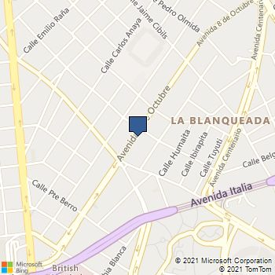
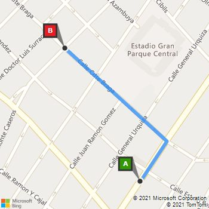

## FIT - Universidad Católica del Uruguay

### Programación II

# Cliente de la API REST que permite trajar con ubicaciones y distancias

Este cliente [`LocationApiClient`](../../blob/master/src/Library/LocationApiClient.cs) permite obtener:

- Coordenadas geográficas a partir de direcciones o puntos de interés

- Distancias entre dos coordenadas geográficas

- Mapas con rutas entre dos coordenadas geográficas

- Mapas de una ubicación

Esta API está basada en [Bing Maps](https://docs.microsoft.com/en-us/bingmaps/). El uso es más simple mediante este cliente y no necesitan obtener una API key.

La API está hosteada en [Azure](https://azure.microsoft.com/en-us/) y fue desarrollada por los profesores para que puedan agregar funcionalidad al bot relacionada con direcciones, distancias, mapas y rutas.

:warning: Estamos usando cuentas gratuitas de Bing Maps y de Azure que permiten enviar una cantidad limitada de peticiones a la API. Por favor usen esta funcionalidad con discreción y sólo para el proyecto del curso.

El cliente hace llamadas a la API REST en forma asincrónica. Por eso los métodos están marcados como `async`. Para usarlos deben agregar antes de la llamada al método la palabra clave `await` y el método en el que se hace esa llamada debe retornar `async Task` o `async Task<T>` donde `T` es el tipo del resultado. Más información en [Programación asincrónica con async y await](https://docs.microsoft.com/es-es/dotnet/csharp/programming-guide/concepts/async/).

### Obtener las coordenadas de una dirección

```csharp
const string addressCentral = "Av. 8 de Octubre 2738";
const string addressMullin = "Comandante Braga 2715";
LocationApiClient client = new LocationApiClient();

Location locationCentral = await client.GetLocation(addressCentral);
Console.WriteLine($"Las coordenadas de '{addressCentral}' son " +
    $"'{locationCentral.Latitude}:{locationCentral.Longitude}'");

Location locationMullin = await client.GetLocation(addressMullin);
Console.WriteLine($"Las coordenadas de '{addressMullin}' son " +
    $"'{locationMullin.Latitude}:{locationMullin.Longitude}'");
```

Esto imprime en la consola:

```bash
Las coordenadas de 'Av. 8 de Octubre 2738' son '-34.88845:-56.15922'
Las coordenadas de 'Comandante Braga 2715' son '-34.88446:-56.16203'
```

El método [`GetLocation`](../../blob/master/src/Library/LocationApiClient.cs#L36) soporta los siguientes parámetros:

- Address: Una dirección con calle, número de puerta, etc. o ruta, kilómetro, etc. Es obligatorio.

- City: La ciudad. Es opcional. El valor predeterminado es `Montevideo`.

- Department: El departamento, estado, provincia, etc. Es opcional. El valor predeterminado es `Montevideo`.

- Country: El país. Es opcional. El valor predeterminado es `Uruguay`.

El resultado es de tipo [`Location`](../../blob/master/src/Library/Location.cs) que además de las coordenadas `Latitude`, `Longitude`, y otros datos normalizados de la dirección, incluye un valor `Found` que indica si la dirección se encontró o no. Tengan en cuenta que no todas las direcciones pueden ser encontradas, prueben buscarlas en [Bing Maps](https://www.bing.com/maps) para estar seguros.

Las instancias de `Location` se utilizan posteriormente para calcular la distancia entre dos coordenadas o para descargar una mapa de una coordenada, como explicamos más adelante.

> En el proyecto pueden usar este método de la API para guardar la coordenada de la dirección de las empresas y de los emprendedores, y también para calcular las distancias entre dos coordenadas, por ejemplo, para saber qué empresas ofrecen cierto material y son las más cercanas a un emprendedor 😉

### Obtener la distancia entre dos coordenadas o entre dos direcciones

```csharp
Distance distance = await client.GetDistance(locationCentral, locationMullin);
Console.WriteLine($"La distancia entre '{locationCentral.Latitude},{locationCentral.Longitude}' y "+
    $"'{locationMullin.Latitude},{locationMullin.Longitude}' es de {distance.TravelDistance} kilómetros.");

distance = await client.GetDistance(addressCentral, addressMullin);
Console.WriteLine($"La distancia entre '{addressCentral}' y '{addressMullin}' " +
    $"es de {distance.TravelDistance} kilómetros.");
```

Esto imprime en la consola:

```bash
La distancia entre '-34.88845,-56.15922' y '-34.88446,-56.16203' es de 0.608 kilómetros.
La distancia entre 'Av. 8 de Octubre 2738' y 'Comandante Braga 2715' es de 0.608 kilómetros.
```

El resultado de tipo [`Distance`](../../blob/master/src/Library/Distance.cs) incluye la distancia en kilómetros y tiempo en minutos que se demora en recorrer esa distancia en auto.

El método [`GetDistance`](../../blob/master/src/Library/LocationApiClient.cs#L58) está sobrecargado y pude ser usado tanto con dos instancias de `Location` previamente obtenidas usando el método `GetLocation` como con direcciones. Es más confiable usar `Location` en lugar de direcciones, porque como explicamos antes, las direcciones no siempre pueden ser obtenidas.

> **Nota** Cuando usen la versión con direcciones, agreguen además de la dirección, la ciudad, el departamento, y el país.

### Descargar el mapa de una coordenada

```csharp
await client.DownloadMap(locationCentral.Latitude, locationCentral.Longitude, @"map.png");
Console.WriteLine($"Descargado el mapa de '{addressCentral}'");
```

Esto descarga un mapa como este:



Por simplicidad no es posible cambiar el tamaño del mapa, pero sí pueden cambiar el nivel de zoom.

El método [`DownloadMap`](../../blob/master/src/Library/LocationApiClient.cs#DownloadMap) soporta los siguientes parámetros:

- Latitude: La latitud de la coordenada en el centro del mapa. Es obligatorio.

- Longitude: La longigut de la coordenada en el centro del mapa. Es obligatorio.

- Path: La ubicación del archivo a guardar. Si existe el archivo se sobrescribe sin avisar. Es obligatorio.

- ZoomLevel: Un valor entre 1 y 20. El valor predeterminado es 15. Es opcional.

> Con este método podrían devolver una imagen al usuario en el bot una vez que ingresa su dirección, para confirmar que es correcta.  😉

### Descargar la ruta entre dos coordenadas

```csharp
await client.DownloadRoute(locationCentral.Latitude, locationCentral.Longitude,
    locationMullin.Latitude, locationMullin.Longitude, @"route.png");
Console.WriteLine($"Descargado el mapa de '{addressCentral}' a '{addressMullin}'");
```

Esto descarga un mapa como este:



Por simplicidad no es posible cambiar el tamaño del mapa, se determina automáticamente a partir de las coordenadas del origen y el destino.

El método [`DownloadRoute`](../../blob/master/src/Library/LocationApiClient.cs#DownloadRoute) soporta los siguientes parámetros:

- FromLatitude: La latitud de la coordenada del origen. Es obligatorio.

- FromLongitude: La longigud de la coordenada del origen. Es obligatorio.

- ToLatitude: La latitud de la coordenada del origen. Es obligatorio.

- ToLongitude: La longigud de la coordenada del origen. Es obligatorio.

- Path: La ubicación del archivo a guardar. Si existe el archivo se sobrescribe sin avisar. Es obligatorio.

> Con este método podrían devolver una imagen al usuario en el bot para mostarle dónde tiene que llevar o ir a buscar un material o un residuo.  😉
